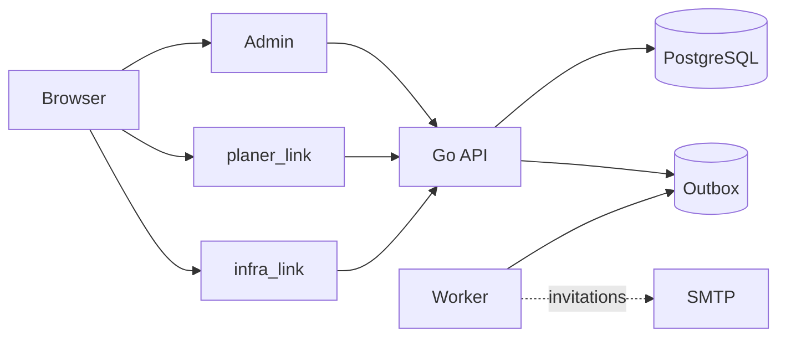

# clinks

clinks is a multi-tenant planning platform. It has three Svelte applications, a Go API, and PostgreSQL.



## Development

You need Docker Desktop, Node.js 24+, pnpm 10+, and Go 1.26.

```sh
cp .env.example .env
pnpm install
git config core.hooksPath .githooks
pnpm start
```

Before starting, replace all secret placeholders in `.env`. Never commit this file.

Open:

- Admin: http://localhost:5173
- planer_link: http://localhost:5174
- infra_link: http://localhost:5175
- API health: http://localhost:8080/healthz

`pnpm start` starts PostgreSQL, applies database migrations, creates the configured initial administrator, and starts the API and all three apps.

For development without Docker, start PostgreSQL yourself, set `DATABASE_URL` in `.env`, then run:

```sh
pnpm dev
```

## Checks

```sh
pnpm verify:push
pnpm test
pnpm go:test
```

The pre-push hook runs `pnpm verify:push` automatically. Enable it once per clone with `git config core.hooksPath .githooks`.

## Production deployment

Production is released only with a `v*` Git tag. GitHub Actions builds immutable GHCR images; the VPS receives only those images, Compose/Nginx configuration, TLS files, and its local `.env`—never a source checkout.

Before the first release, choose a real domain and point these records to the VPS:

- `admin.DOMAIN_PLACEHOLDER`
- `planer.DOMAIN_PLACEHOLDER`
- `infra.DOMAIN_PLACEHOLDER`
- `api.DOMAIN_PLACEHOLDER`

Copy [`deploy/.env.production.example`](deploy/.env.production.example) to `/opt/clinks/.env`, replace its placeholders, make it readable only by the deployment user, and install TLS certificates in `/opt/clinks/tls`. Nginx terminates HTTPS and is the only public container; PostgreSQL, API, and worker remain on an internal network.

The complete first-host setup, backup timer, restore drill, and post-release checks are in [`docs/operations.md`](docs/operations.md).
